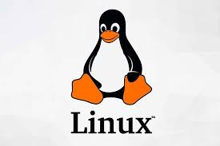
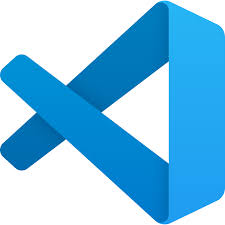
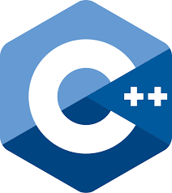
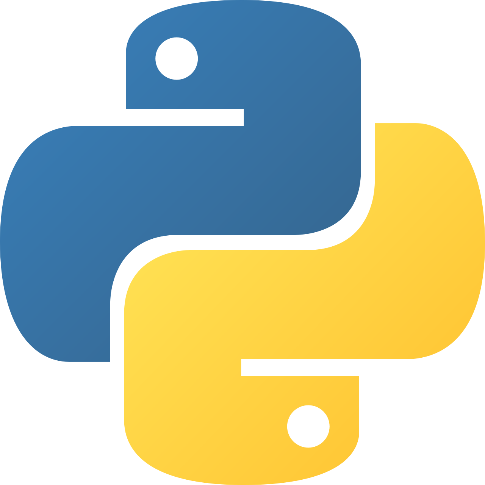

# My name is Nicole Rico Mendoza
**Aspiring Software Developer | Tech Enthusiast | Continuous Learner**
Welcome to my GitHub profile!
I'm passionate  about technology,software development, and *continues improvement*.
Currently building strong foundations in programming,version control and modern development workflows.
## About Me
- Computer science/Systems student
- 📚 Focused on building strong programming fundamentals
- 🛠️ Learning best practices in software development
- 🔄 Exploring modern development workflows
- 🚀 Interested in DevOps, automation, and scalable systems
- 📈 Always improving problem-solving skills
## Technologies and TOols
- Git

- Github

- Linux

- Vs Code

- Nano
## Programming Languages
- C++

-Python 

-Java Script

-Bash 
